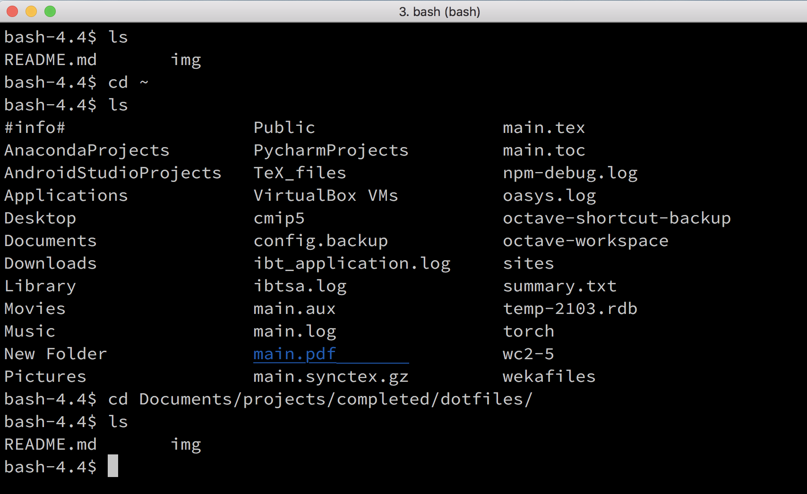
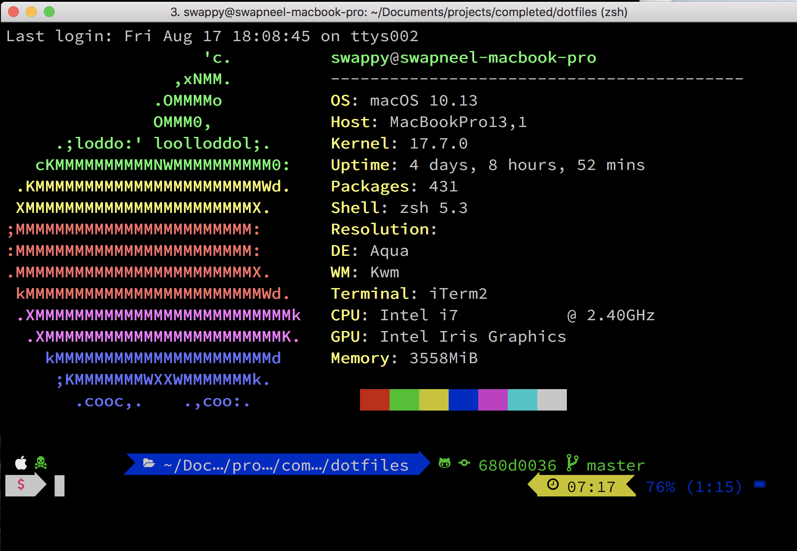

# dotfiles
Configuration for your terminal and text-editor (vim) that will make you look much cooler than you really are.

**If you are a beginner, I strongly suggest you [Read the Theory first](#theory)**

## Gallery


Bored with this plain old uninteresting terminal each time you open your machine? I was.


This is how my terminal looks when I remotely login to my workplace. Note the random quote. Cute.


This is the configuration for my personal machine. When I first open the terminal, I want my (non-programmer) friends to be confused/awed by what is going on. But that's just me.


ZSH is pretty useful in terms of reducing the need to type all your commands repetitively


It is insanely helpful to know the branch, commit, and status of your current directory. Trust me on this.


Yep, `thefuck` basically tells you what the fuck your command should be like. Also cute.

## Prerequisites

- [Oh My ZSH](https://github.com/robbyrussell/oh-my-zsh) (install to `~/.oh-my-zsh`)
- [Powerlevel9k](https://github.com/bhilburn/powerlevel9k/wiki/Install-Instructions) (install, then copy to `~/.oh-my-zsh/themes/`)
- [NeoVim](https://github.com/neovim/neovim) (standalone - if you don't use this then don't install it and remove the corresponding line from `~/.zshrc`)
- [ZSH Autosuggestions](https://github.com/zsh-users/zsh-autosuggestions) (this should go in `~/.oh-my-zsh/plugins`)
- [ZSH Syntax Highlighting](https://github.com/zsh-users/zsh-syntax-highlighting) (this should go in `~/.oh-my-zsh/plugins`)
- [Neofetch](https://github.com/dylanaraps/neofetch) (standalone)
- [The Fuck](https://github.com/nvbn/thefuck#installation) (yes, this is for real)

I use [iTerm2](https://www.iterm2.com/features.html) for the Mac (unfortunately not available on Linux, but it isn't mandatory for this to work). You should definitely consider using it if you're on OSX.

## Tips and Tricks (Read this, it saves you debugging time):

* If you are not sure where you want to clone and install these packages, I suggest you `cd ~` and install all of them there because it enables ease-of-removal should you choose to do so.

* Follow the installation procedures of each of the above packages and you should have most of the setup already complete with the default `~/.zshrc` file with the theme `robbyrussell` active. This is also a good stage to stop and evaluate if this configuration is good enough for your use. If it is, you don't need the rest.

* In case powerlevel9k is not working (symbols displayed on the terminal are gibberish) you most likely need to install the specific font i.e. a font that contains the git symbols for instance). Install [Powerline Fonts](https://github.com/powerline/font) using the [instructions](https://powerline.readthedocs.io/en/latest/installation.html#installation-on-various-platforms). Don't clone the entire directory; use the `depth` flag when cloning:
    ```
    $ git clone https://github.com/powerline/fonts.git --depth=1
    ```

* If you are installing on a machine where you do not have `sudo` privileges, this procedure still works. Just ensure you are installing all the prerequisites from source (i.e. cloning from git (followed by running `make` in case of neovim), and then installing to a local directory.

* ZSH Autosuggestions and ZSH Syntax Highlighting can be cloned into the `~/.oh-my-zsh/plugins` directory and then added into the `~/.zshrc` file on the line where it loads `plugins=(...)` (it's towards the end of the file). I've already made these changes just so you don't have much editing to do later.

## Installation Instructions

* Once you have installed the prerequisites, the next step is to activate a different theme (in this case, the theme I have active). For this, you need to clone this repository:
    ```
    $ git clone https://github.com/SwapneelM/dotfiles ~/dotfiles
    ```

*  Copy the `powerlevel9k` directory to `~/.oh-my-zsh/themes` for it to be available with the other themes.

* Now backup your current .zshrc file:
    ```
    $ mv ~/.zshrc ~/.zshrc.bak
    ```

* Now, move all the files (Vim and ZSH related) to `~` i.e. `.vim_runtime`, `.zshrc`, and `.vimrc`.

* To install the awesome vim configuration, run `sh ~/.vim_runtime/install_awesome_vimrc.sh` (there's also a basic one - check the folder `.vim_runtime` for a README explaining this).

* If you're installing neovim, follow the [instructions for configuration of the vimrc](https://github.com/neovim/neovim/wiki/FAQ#where-should-i-put-my-config-vimrc) (essentially, you have to put it in a folder and rename it as `~/.config/nvim/init.vim`).

* To launch the Z Shell (abbreviated as zsh), just run the command `zsh` from your regular terminal and watch the magic unfold.

* Test the commands `neofetch`, `nvim`, and observe your terminal enter God-mode (no this is a figure of speech, not another Intel vulnerability, geez).

* Once you're certain everything works, and you like `zsh` enough to consider switching over to it try to change your default shell to zsh so that you are able to avoid the need to run the command `zsh` each time you open a shell.
    ```
    $ chsh -s $(which zsh)
    ```
* **For non-root users**, you will have to hack your way around this because it may not allow you to set the default shell. In this case read about the [theory](#theory) for rc files and add a line to the end of your `~/.bashrc`. What happens is each time you login/open a shell, the system runs `source ~/.bashrc` so you're basically asking for it to run a command that calls the Z shell to be executed each time the system sources the file.
    ```
    $ echo "exec zsh" >> ~/.bashrc
    ```

# Theory

## Non-root users

#### **What does this mean?**

* Usually, when you log into your personal computer, you have 'administrator privileges' or 'root privileges' i.e. you can run the `sudo` command. This gives you a lot of control over the installation but also holds you responsible should anything go wrong. Technically, you could actually wipe the entire system clean (delete *literally* everything). Please don't try this.

* Anyway, this root privilege means you can create and install files in the system directories, `/usr/bin`, `/bin`, and so on. That also means that when you run `sudo make install`, your software also gains privileges to copy and create files in the corresponding system directories. That's why it doesn't require much manual copy-pasting labor to get it installed and running.

* However, often whilst configuring this stuff on a new system, you do not have root privileges (and never will, in the near future). In this case, you need to understand some concepts in order to debug the installation should you run into issues (which you shouldn't, but we all know you will).

* When you run a command, the system searches for it on the path. What is this path I speak of? Well, the system stores all its 'commands' which are basically files that are run in the shell in a folder called `/bin`, which, on different systems, is symlinked (symbolically linked, or 'points to') `/usr/bin`, `/usr/sbin`, or whatever else. The point is, all your code to be executed when you type `ls`, or `echo`, or `ifconfig` is stored in such directories that are then put on the system path.

* The system path is essentially a variable that contains a list of ALL the locations/directories to search for a command. You can add, remove, or delete all the paths (please note the original content of the variable before you clear it). Try using `echo $PATH` to see how this works on Unix. You should see a list of directories that contain the code to be run following each command you type.

* For instance when you type `python xyz.py`, the system first looks in `bin`, or whatever directory is first in your `$PATH` variable and finds a link to where the python installation is. Then it executes all your code in `xyz.py` accordingly. This directory called `bin` is common for all users of the system. So the same code runs for all of them when they type `ls`.

* Now you get why you cannot allow anyone to modify the `bin` folder. It's simply because the next time **User X** types `python`, or `ls`, you don't want this modified code by **User Y** to start downloading the latest episode of Sacred Games (or maybe you do) or worse, a computer virus.

* So, as a non-root user, when you try to install things, there are some directories where you cannot write files to. On top of it, some restrictions also mean you cannot `sudo apt-get install` or `brew install`, or `yum install` packages. In such a case, you can usually just download the packages from Github (or elsewhere) and manually install them. The instructions vary by package. 

* The idea, however, is that you can always install in a random directory (in this case, we prefer the `$HOME` or `~` directory) and then add the file to your `$PATH` variable. This tells the system that it has to also look in (for instance) `~/neofetch-5.0.0/` to find the `neofetch` command (in case you have not installed it using `brew` or `apt-get`).

* The same goes for neovim, where I have first added the path to neovim installation to the `$PATH` variable and then added a line called `alias vi='nvim'` which means the `vi` command which I conventionally used to open the `vim` editor is now replaced by the `nvim` command which is searched for on the path and found in the neovim directory:

```
    # added by NeoVim
    export PATH="$HOME/neovim/bin:$PATH"

    # Remove this line if you do not have neovim installed
    alias vi='nvim'
```

**If this is your first time trying out something like this, here are some more ideas that you would do well to be aware of:**

## Dotfiles 

**What exactly are dotfiles?**

**tl;dr**
- Configuration files on unix, or 'dotfiles', often begin with a dot. For example, .vimrc stores your vim settings, .bashrc stores your bash settings, etc.

- In UNIX file systems, dotfiles are text-based configurations files that stores settings of almost every application, service and tool running on your system. These files control the behavior of applications from boot to termination and everything in between. People create backups and elaborate setups of their dotfiles and often share them on GitHub or other code hosting platforms. Helping them setup, their systems faster and restore their configurations when needed.

### .bashrc / .bash_profile / .zshrc / .vimrc

- These files are basically used to define environment variables and append paths that you would require for installed applications. When you run `source ~/.bashrc`, you are just refreshing the definitions of the variables in the file. The same goes for your `~/.bash_profile` or `~/.zshrc` folder.

- In the case of your `.vimrc` file, it contains specific configurations for settings and plugins that are used when you open your text editor with the `vi` command. Each time you modify it, you probably need to shut and reopen the vim editor to refresh those settings. There are also ways to do it from within vim (without shutting it) such as `:so %`. 
Reference: [How to reload .vimrc without shutting vim](https://superuser.com/questions/132029/how-do-you-reload-your-vimrc-file-without-restarting-vim#132030)

Read more: [The difference between .bashrc, .bash_profile, .environment](https://stackoverflow.com/questions/415403/whats-the-difference-between-bashrc-bash-profile-and-environment)

- You copy the same `.vimrc` file and rename it to `init.vim` for your Neovim to use (it must lie within `~/.config/nvim`). But you get that it is the same idea - define custom settings in an `rc` file and then `source` it whenever necessary.

**Why do we need them?**

Now, imagine I break your laptop in a way that the no data can’t be recovered. (Pretty dark, right?) and ask you to restore all your little shortcuts, tweaks, and settings that you took hours to configure in your applications. An impossible task. Not really. This is actually where dotfiles come in, these nifty text files that you save, contain thousands of key-value pairs defining each and every aspect of your applications. You can restore your system back to that point in a matter of minutes. (answer by Vipul Gupta)

Read on Quora: [What are dotfiles](https://www.quora.com/What-are-dotfiles)

### sh 
- sh (or the Shell Command Language) is a programming language described by the POSIX standard. It has many implementations (ksh88, dash, ...). bash can also be considered an implementation of sh. Because sh is a specification, not an implementation, /bin/sh is a symlink (or a hard link) to an actual implementation (such as bash) on most POSIX systems. 

### bash
- bash started as an sh-compatible implementation (although it predates the POSIX standard by a few years), but as time passed it has acquired many extensions. Many of these extensions may change the behavior of valid POSIX shell scripts, so by itself bash is not a valid POSIX shell. Rather, it is a dialect of the POSIX shell language. bash supports a --posix switch, which makes it more POSIX-compliant. It also tries to mimic POSIX if invoked as sh.

Read more: [What is the difference between bash and sh](https://stackoverflow.com/questions/5725296/difference-between-sh-and-bash#5725402)

### zsh

- Zsh is a shell designed for interactive use, although it is also a powerful scripting language. Many of the useful features of bash, ksh, and tcsh were incorporated into zsh; many original features were added. The introductory document details some of the unique features of zsh. It assumes basic knowledge of the standard UNIX shells; the intent is to show a reader already familiar with one of the other major shells what makes zsh more useful or more powerful. This document is not at all comprehensive; read the manual entry for a description of the shell that is complete, concise and up-to-date, although somewhat overwhelming and devoid of examples.

Read more about zsh: [Source Forge](http://zsh.sourceforge.net/)

## Cool-ass Modifications to the Terminal

* For more cool tutorials check out this section on [Awesome ZSH Plugins](https://github.com/unixorn/awesome-zsh-plugins#generic-zsh)
